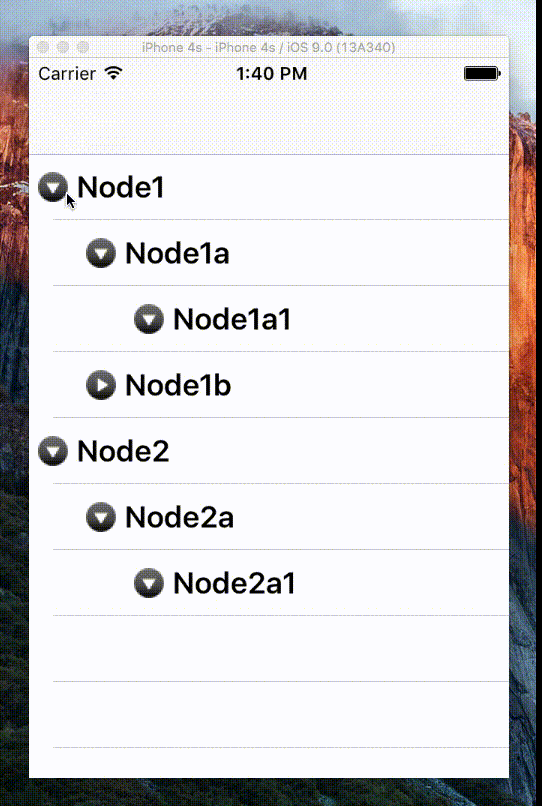

# DKTreeView

Basic implementation of a tree view control for iOS.

## Installation

Copy the files in the TreeView folder to your project.

## Demo
This project includes sample project.

## Notes

- This project was tested with iOS 9.
- Thanks to Jon Limjap who wrote the original [code](https://github.com/LaTtEX/MyTreeViewPrototype).

## Contact

- [github.com/dkhamsing](https://github.com/dkhamsing)
- [twitter.com/dkhamsing](https://twitter.com/dkhamsing)

## License

This project is available under the MIT license. See the [LICENSE](LICENSE) file for more info.